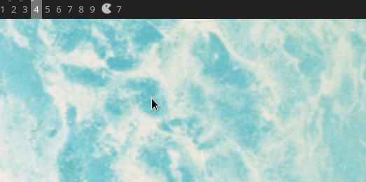

# Pacman widget for AwesomeWM

This widget shows the number of upgradable Pacman packages on a given interval. Clicking the icon reveals a scrollable list of available upgrades.

 

## Installation

Clone the repo under **~/.config/awesome/** and add the following to **rc.lua**:

```lua
local pacman_widget = require('pacman-widget.pacman')
...
s.mytasklist, -- Middle widget
	{ -- Right widgets
    	layout = wibox.layout.fixed.horizontal,
        ...
        -- default
        pacman_widget(),
        -- custom
        pacman_widget{
            interval = 300,
            popup_bg_color = '#000000',
            popup_border_width = 3,
            popup_border_color = '#FFFFFF',
            popup_height = 5,     -- No. packages shown in scrollable window
            popup_width = 200
        },
```

